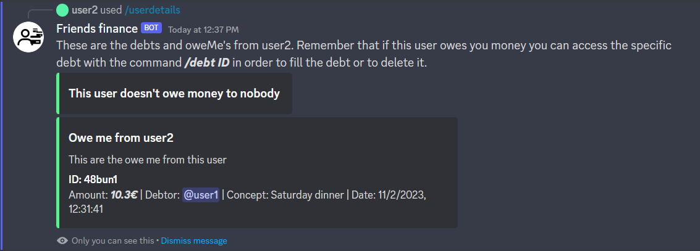

# Check user's details

You can review the active debts from a user. You can also view the debts that this user has against other users.

## /userdetails @user

* **@user**: The user you want to view details from.
  
All the debts from this user will be shown in one block.

You can access a specific debt using the ID in order to fill or delete it as shown [here](/docs/command-guide/fill-or-delete-debts).

**You will get a similar response when using this command:**

