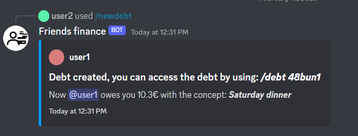

# Create a new debt

This command allows you to create a new debt against other user.

## /newdebt @user amount concept

- **@user**: The username of the person that owes you money.
- **amount**: The amount of money the user @user owes you. This amount should be below the max amount configured by the admin in the bot configuration (by default 40).
- **concept**: You can provide some information about the debt.

When you create this debt the bot automatically saves it to the database. This debt can be accessed as shown [here](/docs/command-guide/fill-or-delete-debts).

**You will get a similar response when using this command:**

