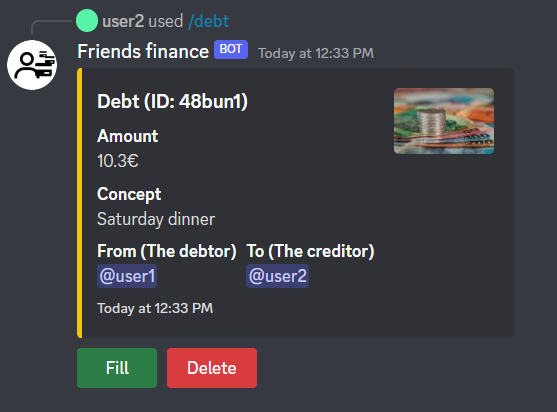

# Fill or delete and view details from a debt

You can view details from a desired debt. When you view de details from a debt you can fill or delete the debt.

## /debt ID

* **ID**: This parameter indicates the debtId. This ID is provided when you create the debt. You can also access this ID when viewing user details as shown [here](/docs/command-guide/check-details-from-a-user)
  
When the message appears you will see the fill and delete buttons.

* **The fill button**: You can use this button when the debtor paid off the debt.
* **The delete button**: You should only use this button if you have mistakenly created a debt.

:::danger Keep in mind
Only the debt author and server admins can delete and fill debts.
:::

**You will get a similar response when using this command:**

